<!-- Generated by GitHub Profile Agent Console. Edit profile.config.json, then run npm run generate. -->

  <picture>
    <source media="(max-width: 760px) and (prefers-color-scheme: dark)" srcset="./assets/hero/agent-console-ab6278ff-mobile-dark.svg">
    <source media="(max-width: 760px)" srcset="./assets/hero/agent-console-ab6278ff-mobile-light.svg">
    <source media="(prefers-color-scheme: dark)" srcset="./assets/hero/agent-console-ab6278ff-dark.svg">
    <source media="(prefers-color-scheme: light)" srcset="./assets/hero/agent-console-ab6278ff-light.svg">
    
  </picture>

  

## About Me

I'm an Information Technology student at Telkom University with hands-on fullstack development experience — building backends with Express.js and Next.js frontends, working with PostgreSQL and Prisma ORM, and deploying applications on Linux servers with Docker and Nginx.

More recently, I've been expanding into cloud infrastructure and DevOps practices, exploring AWS, Azure, CI/CD pipelines, and Infrastructure as Code to build more reliable and scalable systems end-to-end.

## Current Focus

| Area | What I am exploring |
| --- | --- |
| **Fullstack Development** | Building end-to-end web applications with Express.js, Next.js, and Prisma ORM. |
| **Backend Engineering** | Designing robust REST APIs, working with PostgreSQL databases, and managing server application logic. |
| **Cloud & DevOps** | Automating deployments with GitLab CI/CD, configuring Docker containers, and managing AWS/Azure VMs. |
| **Database Management** | Designing database schemas, managing PostgreSQL databases, and optimizing query performance using Prisma. |

## Featured Work

| Project | Focus | Why it matters |
| --- | --- | --- |
| [**BJB Perencanaan**](https://github.com/nashwaalya/BJB_Perencanaan) | Fullstack Document Management System | Built an internal document management system — backend with Express.js and PostgreSQL/Prisma ORM, deployed on Azure VM with Nginx as reverse proxy. |
| [**Aplikasi Jabaraya**](https://github.com/Yoshirmdn/Tubes-Chevalier-FE) | React Frontend Development | Contributed as a frontend developer for Jabaraya, building the user interface using React and Vite to deliver a responsive experience. |

## Research Direction

I'm building end-to-end fluency across the stack — from designing backend APIs and frontend interfaces to automating how they get deployed and scaled in the cloud.

## Tech Stack

`Node.js` · `Express.js` · `Next.js` · `React` · `PostgreSQL` · `Prisma ORM` · `REST API` · `Docker` · `AWS EC2` · `AWS S3` · `Microsoft Azure VM` · `GitLab CI/CD` · `Nginx` · `Terraform` · `Git` · `Linux (Ubuntu)` · `Golang`

## Recent Activity

<!-- AUTO:ACTIVITY:START -->
- Jul 16, 2026: pushed 1 commit to [nashwaalya/nashwaalya](https://github.com/nashwaalya/nashwaalya).
- Jul 16, 2026: created a branch in [nashwaalya/nashwaalya](https://github.com/nashwaalya/nashwaalya).
- Jul 14, 2026: pushed 1 commit to [nashwaalya/BJB_Perencanaan](https://github.com/nashwaalya/BJB_Perencanaan).
- Jul 10, 2026: pushed 1 commit to [nashwaalya/BJB_Perencanaan](https://github.com/nashwaalya/BJB_Perencanaan).
- Jul 9, 2026: pushed 1 commit to [nashwaalya/BJB_Perencanaan](https://github.com/nashwaalya/BJB_Perencanaan).
- Jul 8, 2026: pushed 1 commit to [nashwaalya/BJB_Perencanaan](https://github.com/nashwaalya/BJB_Perencanaan).
<!-- AUTO:ACTIVITY:END -->

---

  Building thoughtful systems and sharing what works.

